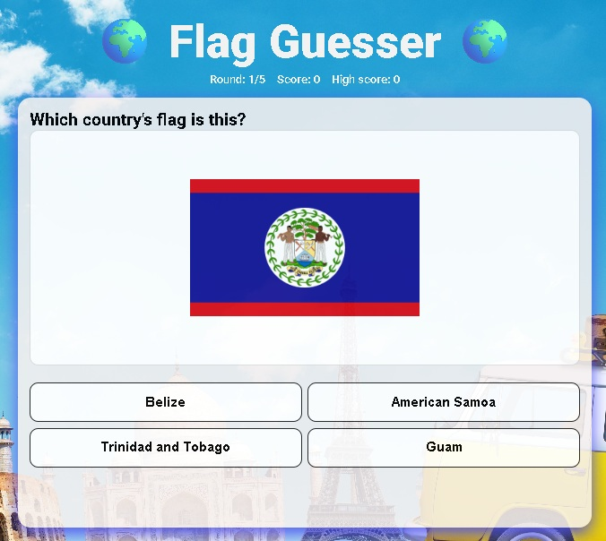

# REST Countries – TypeScript Quiz 🎯
# See the Flag Guess the country


**In this is a mini game:** 
You see a Flag of a random country. You choose the correct country name from the options given.  
You play a 5 rounds. You see your result.
You can also see the best result so far.
You are welcome to hit 5/5 GOOD LUCK.

## What this project uses
- **HTML + CSS + TypeScript** (no frameworks)
- **REST Countries API** to get real country data
- **localStorage** to remember things (like best score)

## Quick start
```bash
npm i
npm run dev    # compile TypeScript and watch (no server)
# Then open index.html in the browser (Live Server recommended)
======also========
npm run build   # compile TS to dist/
npm run preview # start a simple server on port 5173
