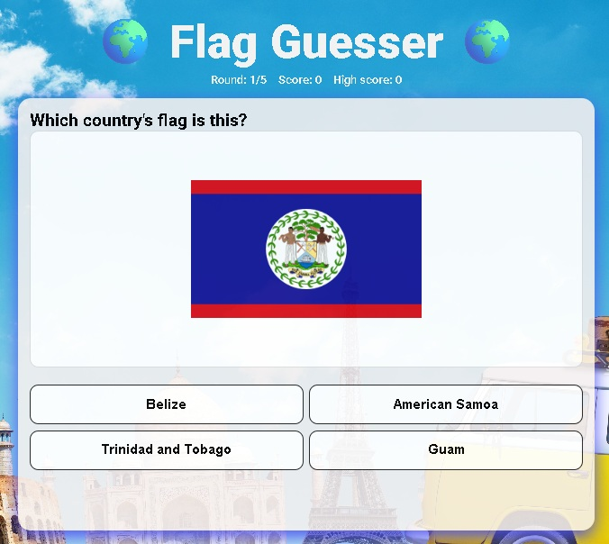

# REST Countries – TypeScript Quiz 🎯
# See the Flag Guess the country

# 🌍 Flag Guesser

A responsive country flag guessing game built with **TypeScript, HTML and CSS**.

The player gets 5 randomly generated flag questions, chooses from four countries, receives instant feedback, and can track their best score using localStorage.

## ✨ Features

- 5 randomized flag questions per game
- Country and flag data fetched from a public API
- Four randomized answer options
- Correct/wrong answer feedback with sound
- Score and high-score tracking
- High score saved with localStorage
- Responsive desktop and mobile layout
- Written in vanilla TypeScript without a frontend framework

## 🛠️ Technologies

- TypeScript
- JavaScript
- HTML5
- CSS3
- Fetch API
- CountriesNow API
- localStorage

## 💻 Run locally

npm install
npm run build
npm run preview
